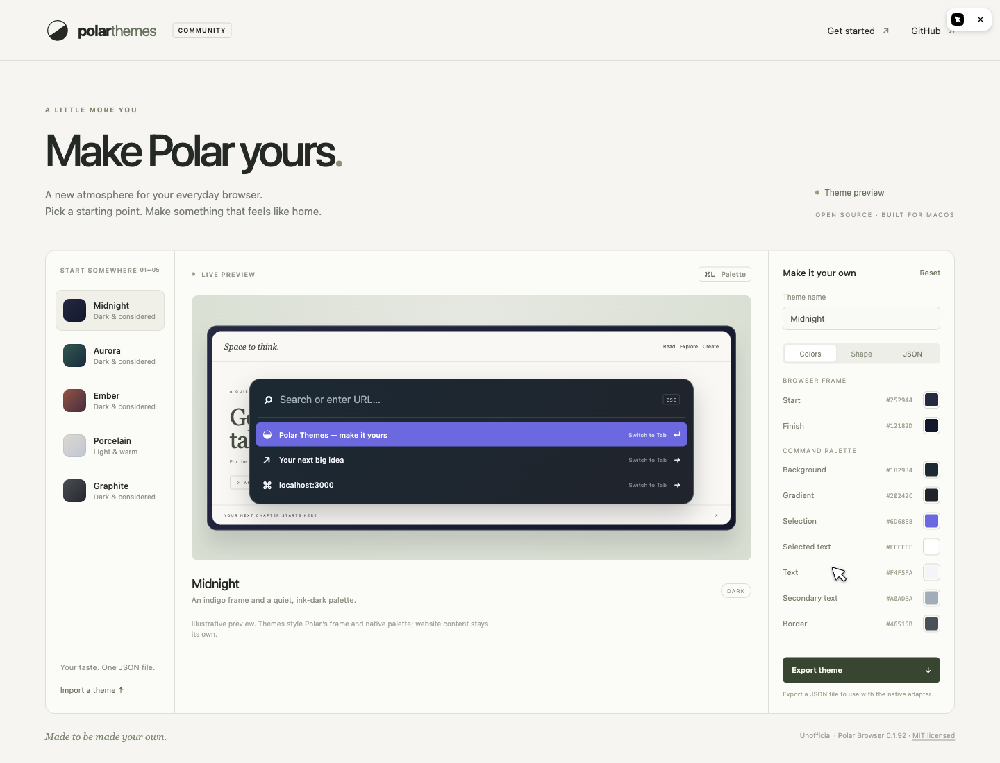

<div align="center">

# Polar Browser Themes

**Make Polar yours.**

Native browser themes. A live theme studio. One JSON file.

[](https://github.com/maxmoneycash/polar-browser-themes/actions/workflows/checks.yml)
[](LICENSE)
[](docs/COMPATIBILITY.md)

[**Open the theme studio ↗**](https://maxmoneycash.github.io/polar-browser-themes/) · [Create a theme](docs/THEMES.md) · [Native installation](docs/INSTALL.md) · [Contribute](CONTRIBUTING.md)

</div>

<!-- Studio screenshots are illustrative previews, not screenshots of installed browser chrome. -->


An **unofficial, experimental customization toolkit for Polar Browser**. Design a theme in the browser, export it as JSON, and load it into the native macOS adapter. Edit your theme file and watch the frame and floating command palette update.

The studio works independently of Polar. The native adapter currently targets **Polar 0.1.92, build 20260913071337, Apple Silicon**. It checks the exact executable before making changes. See [compatibility and signing tradeoffs](docs/COMPATIBILITY.md) before installing.

## What you can make

- **Your own browser frame:** two-color gradients, page inset, and continuous rounded corners.
- **Your own ⌘L palette:** background, accent, text colors, width, row spacing, and type size.
- **A quieter layout:** hide the top tabs and toolbar; restore them with ⌘⇧D.
- **Shareable themes:** complete, validated JSON documents with a public schema.
- **Live edits:** the native renderer keeps the last valid theme when an edit is invalid.

Website content keeps its own styling. This version does not restyle Polar’s sidebar, settings, or built-in agent interface.

[See the themes running in Polar →](docs/GALLERY.md)

## Five starting points

| Theme | Mood | Appearance |
| --- | --- | --- |
| [Midnight](polar_themes/assets/themes/midnight.json) | Indigo frame, quiet ink-dark palette | Dark |
| [Aurora](polar_themes/assets/themes/aurora.json) | Evergreen and cool mint | Dark |
| [Ember](polar_themes/assets/themes/ember.json) | Copper, charcoal, and warm highlights | Dark |
| [Porcelain](polar_themes/assets/themes/porcelain.json) | Warm paper and violet | Light |
| [Graphite](polar_themes/assets/themes/graphite.json) | Neutral surfaces and compact rows | Dark |

## Quick start

Python 3.9+; no Python runtime dependencies. You can also use the [hosted studio](https://maxmoneycash.github.io/polar-browser-themes/) without installing anything.

```sh
git clone https://github.com/maxmoneycash/polar-browser-themes.git
cd polar-browser-themes
./polar-themes list
./polar-themes studio
```

Open the local URL printed by the CLI in your browser. Pick a theme, adjust colors and shape, then export a file. The local studio can also save a theme for the native adapter. The hosted studio only previews and exports.

To change Polar itself, [build and install the native adapter](docs/INSTALL.md) from your own supported Polar installation. No browser binary is included in this repository.

```sh
# After installing the native adapter:
./polar-themes use aurora
./polar-themes new my-theme.json --from porcelain
./polar-themes validate my-theme.json
./polar-themes use my-theme.json
./polar-themes undo
```

The CLI writes `~/Library/Application Support/Polar Themes/current.json`. The native adapter reloads valid changes within about a second, including while the palette is open. `reset` restores Midnight; `undo` restores the previously applied theme.

## Build on it

Theme authors only need JSON. Tool builders can use the Python library:

```python
from polar_themes import load_theme, validate_theme
from polar_themes.theme import apply_theme

theme = load_theme("midnight")
theme["name"] = "My Midnight"
theme["palette"]["accent"] = "#A995FF"
validate_theme(theme)
apply_theme(theme)
```

The [JSON Schema](polar_themes/assets/schema/theme.schema.json) is shared by the CLI, studio, and native validator. The native UI is AppKit; theme values are translated into native colors and geometry. No scripts execute from theme files.

The [architecture guide](docs/ARCHITECTURE.md) explains the boundaries between portable theme tools and the version-specific adapter. The [theme reference](docs/THEMES.md) covers every supported setting.

## Development

```sh
python3 -m unittest discover -s tests -v
python3 scripts/build_site.py

# macOS + Xcode command-line tools; does not modify or launch Polar:
python3 scripts/native_adapter.py build --library-only
```

The CI checks theme validation, rejected writes, local studio authorization, and native compilation. Browser and installed-app verification are recorded separately in [VALIDATION.md](docs/VALIDATION.md).

## Why this exists

This started with a concrete preference: a calmer Polar window and a floating address bar. The native prototype became a small theme engine so other people could create their own appearance without editing Objective-C.

The project is independent of Recursive Intelligence and is not an official Polar extension API. It uses a version-specific native adapter, so application updates require compatibility work. Improvements to accessibility, theme creation, native integration, and reproducible testing are welcome.

## Contributing a theme

Start with `./polar-themes new`, give your theme its own ID and author, and test text readability in both the normal and selected palette rows. Open a pull request with the JSON and a studio screenshot. See [CONTRIBUTING.md](CONTRIBUTING.md).

MIT licensed. Polar’s app and trademarks remain the property of their respective owners.
