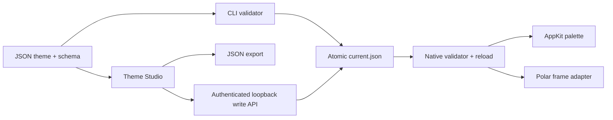

# Architecture

Polar Themes has a portable, data-only theme layer and an experimental native adapter. Keeping those boundaries explicit makes it possible to build theme tooling without modifying a browser.

## Theme contract

`polar_themes/assets/schema/theme.schema.json` defines format v1. Themes are complete documents: no inheritance, evaluation, remote assets, arbitrary paths, or JavaScript. The deliberately small schema vocabulary is supported by three validators:

- Python: CLI, local HTTP write endpoint, and repository tests.
- JavaScript: immediate studio feedback before preview/export.
- Objective-C: validation at the point a theme enters the native UI.

The Python decoder also rejects duplicate JSON keys. Always run the CLI validator on a file before sharing it. The native JSON parser uses Foundation’s parsing behavior.

The builder embeds the schema and default Midnight theme into the native library. A missing configuration file therefore still has a deterministic default. Valid changes replace the active theme; invalid changes leave the last valid theme intact.

## Studio

The studio is plain HTML, CSS, and JavaScript with no third-party assets, build framework, analytics, fonts, or runtime CDN requests. The preview illustrates browser chrome using a mock page; it is not a screenshot of the actual Polar window.

Hosted mode only reads bundled presets and exports files. Local mode binds an HTTP server to `127.0.0.1`. Every write requires a per-process capability token, exact Host header, same-origin request, JSON content type, size limit, and schema validation. The token is passed in the URL fragment, removed from the address bar after loading, and sent only in a request header. Static file routes are restricted to the editor assets, theme JSON, and schema.

## Native runtime

`ThemeRuntime.m` loads and validates the active theme on the main thread. A one-second timer in common run-loop mode catches atomic file replacements and updates an already-open palette. The timer reads a single bounded local file; no network calls or subprocesses are made by the theme runtime.

`ZenPalette.m` draws native AppKit controls. Navigation uses the same version-specific Swift bridge as the original prototype. Search text never becomes a shell command. Theme appearance is scoped to the palette window; it does not change the web page’s preferred color scheme.

`ThemeFrame.m` adds a non-interactive gradient backdrop behind Polar’s content container. During the original browser layout, it transforms frame assignments on the page container and browser host before the host can publish its viewport to Chromium. The overrides are restricted to those two Polar classes and the active browser layout. Afterward, it aligns matching overlays and applies continuous corner clipping. Showing the original controls hides the custom backdrop and preserves native geometry.

The ordering matters: resizing the browser host after native layout creates competing viewport sizes and can trigger an endless resize loop. The AppKit regression test observes frame notifications, checks that only the final themed size is published, and verifies that repeated layouts do not change it.

## Compatibility adapter

The existing native prototype provides reversible layout patches, keyboard commands, and tab/navigation entry points. Thirteen ARM64 instructions branch into pre-verified unused padding. A flag in unused data padding selects the original or customized layout. Runtime code does not write executable memory.

The public builder verifies the full original executable hash and each instruction preimage, checks available load-command padding, inserts the local library reference, then signs a copied app. The install step is separate and refuses a running or unknown app. No proprietary binary is included in the repository.

The most fragile boundary is the private Swift ABI and layout geometry. It is intentionally contained in the native adapter. A newer Polar build must be inspected and tested before adding support. See [COMPATIBILITY.md](COMPATIBILITY.md).

## Repository map

| Path | Responsibility |
| --- | --- |
| `polar_themes/theme.py` | Schema validation, theme loading, atomic writes, undo |
| `polar_themes/server.py` | Local studio server and authenticated write endpoint |
| `polar_themes/assets/` | Shared schema, gallery themes, static studio |
| `native/ThemeRuntime.*` | Native parsing, validation, hot reload, theme values |
| `native/ThemeFrame.m` | Frame appearance and content geometry |
| `native/ZenPalette.m` | Native floating palette |
| `native/PolarZen.m`, `ZenBridge.swift` | Version-specific native browser integration |
| `native/compat.py` | Executable hash and patch preimages |
| `scripts/native_adapter.py` | Build, verify, install, and restore |
| `tests/` | Validation, authorization, atomic writes, compatibility guards |
