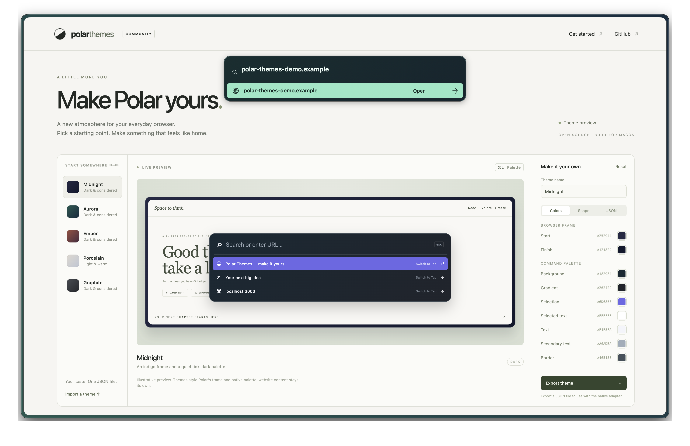
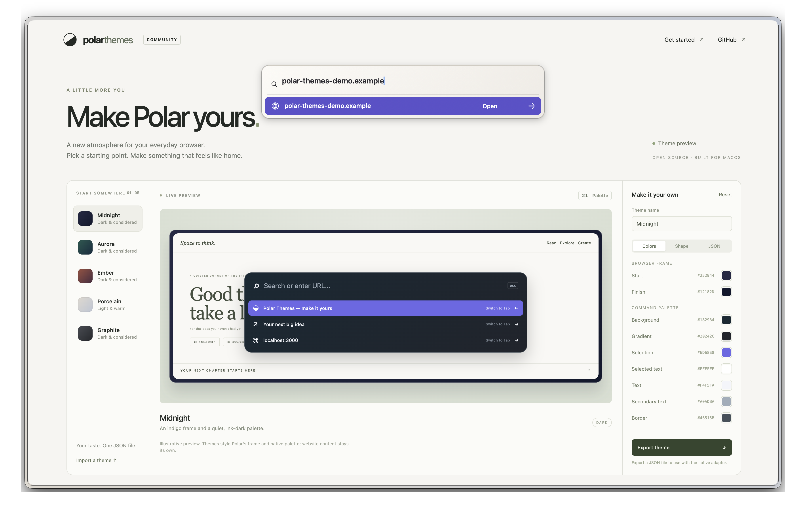

# Themes in Polar

These are actual window captures from Polar 0.1.92 on macOS, taken while switching themes with the native ⌘L palette open. The floating panel near the top and the outer window frame are native. The larger panel inside the webpage is the studio's illustrative preview.

## Aurora

An evergreen frame with a mint selection and a dark command palette.

## Porcelain

The same window and open palette after applying the light theme, without restarting Polar.

Use the [live studio](https://maxmoneycash.github.io/polar-browser-themes/) to preview all five presets, or read the [native installation guide](INSTALL.md) and [validation notes](VALIDATION.md) before changing your browser.
